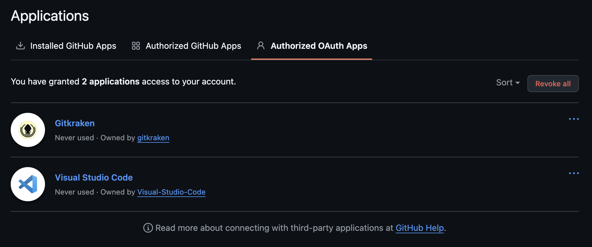

# AI/SW 개발 워크스테이션 구축

## 1. 프로젝트 개요

터미널(Linux CLI), Docker, Git/GitHub 세 가지 핵심 도구를 직접 세팅하고 검증하는 미션입니다.
코드가 "내 컴퓨터에서만" 돌아가는 문제를 줄이고, 팀원 누구나 같은 방식으로 실행/배포/디버깅할 수 있는 환경 구성을 목표로 합니다.

---

## 2. 실행 환경

| 항목 | 내용 |
|------|------|
| OS | macOS (Darwin 24.6.0, x86_64) |
| Shell | zsh |
| Docker | 28.5.2 |
| Git | 2.53.0 |

---

## 3. 수행 항목 체크리스트

- [ ] 터미널 기본 조작 및 폴더 구성
- [ ] 권한 변경 실습
- [ ] Docker 설치/점검
- [ ] hello-world 실행
- [ ] 이미지/컨테이너 목록 확인 및 정리
- [ ] Dockerfile 빌드/실행
- [ ] 포트 매핑 접속
- [ ] 바인드 마운트 반영
- [ ] 볼륨 영속성 검증
- [ ] Git 설정 + GitHub 연동

---

## 4. 터미널 조작 로그

### 4-1. 기본 명령어

```bash
# 현재 위치 확인
$ pwd
/Users/sungminchoidev3025

# 목록 확인 (숨김 파일 포함)
$ ls -la
total 64
drwxr-x---+ 26 sungminchoidev3025  sungminchoidev3025    832 Mar 31 02:50 .
drwxr-xr-x   6 root                admin                 192 Mar 30 16:17 ..
-r--------   1 sungminchoidev3025  sungminchoidev3025      7 Mar 30 16:22 CFUserTextEncoding
-rw-r--r--@  1 sungminchoidev3025  sungminchoidev3025  10244 Mar 31 02:44 .DS_Store
drwx------+  2 sungminchoidev3025  sungminchoidev3025     64 Mar 31 00:47 .Trash
drwxr-xr-x   3 sungminchoidev3025  sungminchoidev3025     96 Mar 30 16:30 .config
drwxr-xr-x   5 sungminchoidev3025  sungminchoidev3025    160 Mar 30 16:18 .docker
-rw-r--r--   1 sungminchoidev3025  sungminchoidev3025     68 Mar 31 02:49 .gitconfig
-rw-------   1 sungminchoidev3025  sungminchoidev3025     20 Mar 31 02:49 .lesshst
drwxr-xr-x   3 sungminchoidev3025  sungminchoidev3025     96 Mar 31 02:46 .local
drwxr-xr-x  10 sungminchoidev3025  sungminchoidev3025    320 Mar 31 00:06 .orbstack
drwxr-xr-x   7 sungminchoidev3025  sungminchoidev3025    224 Mar 31 00:16 .ssh
-rw-------   1 sungminchoidev3025  sungminchoidev3025   1232 Mar 31 02:17 .viminfo
drwxr-xr-x   5 sungminchoidev3025  sungminchoidev3025    160 Mar 31 02:44 .vscode
-rw-------   1 sungminchoidev3025  sungminchoidev3025   1207 Mar 31 02:50 .zsh_history
drwx------  15 sungminchoidev3025  sungminchoidev3025    480 Mar 31 02:50 .zsh_sessions
drwx------+  7 sungminchoidev3025  sungminchoidev3025    224 Mar 31 00:44 Desktop
drwx------+  3 sungminchoidev3025  sungminchoidev3025     96 Mar 30 16:17 Documents
drwx------+  7 sungminchoidev3025  sungminchoidev3025    224 Mar 31 02:44 Downloads
drwx------@ 84 sungminchoidev3025  sungminchoidev3025   2688 Mar 31 00:47 Library
drwx------   3 sungminchoidev3025  sungminchoidev3025     96 Mar 30 16:17 Movies
drwx------+  3 sungminchoidev3025  sungminchoidev3025     96 Mar 30 16:17 Music
drwx------   4 sungminchoidev3025  sungminchoidev3025    160 Mar 31 02:36 OrbStack
drwx------+  4 sungminchoidev3025  sungminchoidev3025    128 Mar 30 16:17 Pictures
drwxr-xr-x+  4 sungminchoidev3025  sungminchoidev3025    128 Mar 30 16:17 Public
drwxr-xr-x   4 sungminchoidev3025  sungminchoidev3025    128 Mar 31 02:44 codyssey-e1-1

# 디렉토리 생성
$ mkdir -p ~/grandParent/parent/child
drwxr-xr-x   3 sungminchoidev3025  sungminchoidev3025     96 Mar 31 02:52 grandParent
$ ls -lR grandParent
total 0
drwxr-xr-x  3 sungminchoidev3025  sungminchoidev3025  96 Mar 31 02:52 parent

grandParent/parent:
total 0
drwxr-xr-x  2 sungminchoidev3025  sungminchoidev3025  64 Mar 31 02:52 child

grandParent/parent/child:
total 0

# 파일 생성
$ touch test.txt
-rw-r--r--   1 sungminchoidev3025  sungminchoidev3025     0 Mar 31 02:53 zero.txt

# 파일 내용 확인
$ cat test.txt


# 복사
$ cp test.txt test_copy.txt


# 이동/이름변경
$ mv test_copy.txt test_renamed.txt


# 삭제
$ rm test_renamed.txt

```

---

## 5. 권한 실습

### 5-1. 파일 권한 변경

```bash
# 변경 전
$ ls -l hello.sh
-rw-r--r--  1 sungminchoidev3025  sungminchoidev3025  35 Mar 31 02:55 hello.sh

# 권한 변경
$ chmod 755 hello.sh

# 변경 후
$ ls -l hello.sh
-rwxr-xr-x  1 sungminchoidev3025  sungminchoidev3025  35 Mar 31 02:55 hello.sh

```

### 5-2. 디렉토리 권한 변경

```bash
# 변경 전
$ ls -ld ~/d_permission
drwxr-xr-x   2 sungminchoidev3025  sungminchoidev3025    64 Mar 31 02:58 d_permission

# 권한 변경
$ chmod 644 ~/d_permission

# 변경 후
$ ls -ld ~/d_permission
drw-r--r--  2 sungminchoidev3025  sungminchoidev3025  64 Mar 31 02:58 /Users/sungminchoidev3025/d_permission

```

---

## 6. Docker 설치 및 기본 점검

```bash
# 버전 확인
$ docker --version
Docker version 28.5.2, build ecc6942

# 데몬 동작 확인
$ docker info
Client:
 Version:    28.5.2
 Context:    orbstack
 Debug Mode: false
 Plugins:
  buildx: Docker Buildx (Docker Inc.)
    Version:  v0.29.1
    Path:     /Users/sungminchoidev3025/.docker/cli-plugins/docker-buildx
  compose: Docker Compose (Docker Inc.)
    Version:  v2.40.3
    Path:     /Users/sungminchoidev3025/.docker/cli-plugins/docker-compose

Server:
 Containers: 0
  Running: 0
  Paused: 0
  Stopped: 0
 Images: 0
 Server Version: 28.5.2
 Storage Driver: overlay2
  Backing Filesystem: btrfs
  Supports d_type: true
  Using metacopy: false
  Native Overlay Diff: true
  userxattr: false
 Logging Driver: json-file
 Cgroup Driver: cgroupfs
 Cgroup Version: 2
 Plugins:
  Volume: local
  Network: bridge host ipvlan macvlan null overlay
  Log: awslogs fluentd gcplogs gelf journald json-file local splunk syslog
 CDI spec directories:
  /etc/cdi
  /var/run/cdi
 Swarm: inactive
 Runtimes: io.containerd.runc.v2 runc
 Default Runtime: runc
 Init Binary: docker-init
 containerd version: 1c4457e00facac03ce1d75f7b6777a7a851e5c41
 runc version: d842d7719497cc3b774fd71620278ac9e17710e0
 init version: de40ad0
 Security Options:
  seccomp
   Profile: builtin
  cgroupns
 Kernel Version: 6.17.8-orbstack-00308-g8f9c941121b1
 Operating System: OrbStack
 OSType: linux
 Architecture: x86_64
 CPUs: 6
 Total Memory: 15.67GiB
 Name: orbstack
 ID: 11ed3134-3a51-4e79-a78e-9f2cc25b0162
 Docker Root Dir: /var/lib/docker
 Debug Mode: false
 Experimental: false
 Insecure Registries:
  ::1/128
  127.0.0.0/8
 Live Restore Enabled: false
 Product License: Community Engine
 Default Address Pools:
   Base: 192.168.97.0/24, Size: 24
   Base: 192.168.107.0/24, Size: 24
   Base: 192.168.117.0/24, Size: 24
   Base: 192.168.147.0/24, Size: 24
   Base: 192.168.148.0/24, Size: 24
   Base: 192.168.155.0/24, Size: 24
   Base: 192.168.156.0/24, Size: 24
   Base: 192.168.158.0/24, Size: 24
   Base: 192.168.163.0/24, Size: 24
   Base: 192.168.164.0/24, Size: 24
   Base: 192.168.165.0/24, Size: 24
   Base: 192.168.166.0/24, Size: 24
   Base: 192.168.167.0/24, Size: 24
   Base: 192.168.171.0/24, Size: 24
   Base: 192.168.172.0/24, Size: 24
   Base: 192.168.181.0/24, Size: 24
   Base: 192.168.183.0/24, Size: 24
   Base: 192.168.186.0/24, Size: 24
   Base: 192.168.207.0/24, Size: 24
   Base: 192.168.214.0/24, Size: 24
   Base: 192.168.215.0/24, Size: 24
   Base: 192.168.216.0/24, Size: 24
   Base: 192.168.223.0/24, Size: 24
   Base: 192.168.227.0/24, Size: 24
   Base: 192.168.228.0/24, Size: 24
   Base: 192.168.229.0/24, Size: 24
   Base: 192.168.237.0/24, Size: 24
   Base: 192.168.239.0/24, Size: 24
   Base: 192.168.242.0/24, Size: 24
   Base: 192.168.247.0/24, Size: 24
   Base: fd07:b51a:cc66:d000::/56, Size: 64

```

---

## 7. Docker 기본 운영 명령

```bash
# 이미지 목록
$ docker images
REPOSITORY   TAG       IMAGE ID       CREATED      SIZE
nginx        latest    0cf1d6af5ca7   5 days ago   161MB

# 컨테이너 목록 (실행 중)
$ docker ps
CONTAINER ID   IMAGE     COMMAND   CREATED   STATUS    PORTS     NAMES

# 컨테이너 목록 (전체)
$ docker ps -a
CONTAINER ID   IMAGE     COMMAND                  CREATED         STATUS                     PORTS     NAMES
7fc853c7adf2   nginx     "/docker-entrypoint.…"   3 seconds ago   Up 2 seconds               80/tcp    nervous_cerf
7f3d8e5f4da6   nginx     "/docker-entrypoint.…"   9 seconds ago   Exited (0) 5 seconds ago             zen_merkle

# 로그 확인
$ docker logs <container_name>
/docker-entrypoint.sh: /docker-entrypoint.d/ is not empty, will attempt to perform configuration
/docker-entrypoint.sh: Looking for shell scripts in /docker-entrypoint.d/
/docker-entrypoint.sh: Launching /docker-entrypoint.d/10-listen-on-ipv6-by-default.sh
10-listen-on-ipv6-by-default.sh: info: Getting the checksum of /etc/nginx/conf.d/default.conf
10-listen-on-ipv6-by-default.sh: info: Enabled listen on IPv6 in /etc/nginx/conf.d/default.conf
/docker-entrypoint.sh: Sourcing /docker-entrypoint.d/15-local-resolvers.envsh
/docker-entrypoint.sh: Launching /docker-entrypoint.d/20-envsubst-on-templates.sh
/docker-entrypoint.sh: Launching /docker-entrypoint.d/30-tune-worker-processes.sh
/docker-entrypoint.sh: Configuration complete; ready for start up
2026/03/30 18:04:16 [notice] 1#1: using the "epoll" event method
2026/03/30 18:04:16 [notice] 1#1: nginx/1.29.7
2026/03/30 18:04:16 [notice] 1#1: built by gcc 14.2.0 (Debian 14.2.0-19)
2026/03/30 18:04:16 [notice] 1#1: OS: Linux 6.17.8-orbstack-00308-g8f9c941121b1
2026/03/30 18:04:16 [notice] 1#1: getrlimit(RLIMIT_NOFILE): 20480:1048576
2026/03/30 18:04:16 [notice] 1#1: start worker processes
2026/03/30 18:04:16 [notice] 1#1: start worker process 29
2026/03/30 18:04:16 [notice] 1#1: start worker process 30
2026/03/30 18:04:16 [notice] 1#1: start worker process 31
2026/03/30 18:04:16 [notice] 1#1: start worker process 32
2026/03/30 18:04:16 [notice] 1#1: start worker process 33
2026/03/30 18:04:16 [notice] 1#1: start worker process 34

# 리소스 확인
$ docker stats
CONTAINER ID   NAME           CPU %     MEM USAGE / LIMIT     MEM %     NET I/O         BLOCK I/O         PIDS
7fc853c7adf2   nervous_cerf   0.00%     6.477MiB / 15.67GiB   0.04%     1.13kB / 126B   11.5MB / 8.19kB   7

```

---

## 8. 컨테이너 실행 실습

### 8-1. hello-world 실행

```bash
$ docker run hello-world
Unable to find image 'hello-world:latest' locally
latest: Pulling from library/hello-world
4f55086f7dd0: Pull complete
Digest: sha256:452a468a4bf985040037cb6d5392410206e47db9bf5b7278d281f94d1c2d0931
Status: Downloaded newer image for hello-world:latest

Hello from Docker!
This message shows that your installation appears to be working correctly.

To generate this message, Docker took the following steps:
 1. The Docker client contacted the Docker daemon.
 2. The Docker daemon pulled the "hello-world" image from the Docker Hub.
    (amd64)
 3. The Docker daemon created a new container from that image which runs the
    executable that produces the output you are currently reading.
 4. The Docker daemon streamed that output to the Docker client, which sent it
    to your terminal.

To try something more ambitious, you can run an Ubuntu container with:
 $ docker run -it ubuntu bash

Share images, automate workflows, and more with a free Docker ID:
 https://hub.docker.com/

For more examples and ideas, visit:
 https://docs.docker.com/get-started/

```

### 8-2. ubuntu 컨테이너 진입

```bash
$ docker run -it ubuntu bash

# 컨테이너 내부
$ ls
bin   dev  home  lib64  mnt  proc  run   srv  tmp  var
boot  etc  lib   media  opt  root  sbin  sys  usr

$ echo "hello from container"
hello from container

```

### 8-3. attach vs exec 차이 정리
https://docs.docker.com/reference/cli/docker/container/attach/
https://docs.docker.com/reference/cli/docker/container/exec/

attach는 컨테이너의 메인 프로세스(PID 1)에 직접 연결하므로, 종료 시 컨테이너도 함께 종료된다. exec는 새로운 프로세스를 별도로 실행하므로, 종료해도 컨테이너가 유지된다. 따라서 실행 중인 컨테이너를 디버깅하거나 내부를 확인할 때는 exec가 안전하다.
---

## 9. Dockerfile 기반 커스텀 이미지

### 9-1. 선택한 베이스 이미지
nginx:alpine

### 9-2. 커스텀 포인트 및 목적

FROM은 베이스 이미지 명시
LABEL은 메타데이터를 지정함으로써 각 이미지의 자세한 사항을 확인
ENV은 필요한 환경 변수를 자동으로 설정
COPY는 호스트 파일을 컨테이너에 복사 자동화
EXPOSE를 통해 몇번 포트를 외부에 노출할 것인지 명시

### 9-3. Dockerfile

```dockerfile
FROM nginx:alpine
 
# 이미지 메타데이터 설정
LABEL org.opencontainers.image.title="my-custom-nginx"
LABEL org.opencontainers.image.description="AI/SW 개발 워크스테이션 구축 미션 - 커스텀 nginx 이미지"
 
# 환경 변수 설정
ENV APP_ENV=dev
 
# 정적 콘텐츠 복사
COPY static/ /usr/share/nginx/html/
 
# 80번 포트 노출
EXPOSE 80
```

### 9-4. 빌드 및 실행

```bash
# 빌드
$ docker build -t my-web:1.0 .


# 실행
$ docker run -d -p 8080:80 --name my-web my-web:1.0

```

---

## 10. 포트 매핑 접속 증거

```bash
$ curl http://localhost:8080
```
```html
<!DOCTYPE html>
<html lang="ko">
<head>
    <meta charset="UTF-8">
    <meta name="viewport" content="width=device-width, initial-scale=1.0">
    <title>AI/SW 개발 워크스테이션</title>
</head>
<body>
    <h1>Hello World</h1>
    <p>AI/SW 개발 워크스테이션 구축 미션 - nginx 컨테이너 실행 중</p>
</body>
```

---

## 11. 바인드 마운트 반영


### 실행
```bash
$ docker run -d -v $(pwd)/static:/usr/share/nginx/html -p 8081:80 --name bind-test my-web:1.0
```
### 호스트 파일 수정 전 확인
```bash
$ curl http://localhost:8081
```
```html
<!DOCTYPE html>
<html lang="ko">

<head>
    <meta charset="UTF-8">
    <meta name="viewport" content="width=device-width, initial-scale=1.0">
    <title>AI/SW 개발 워크스테이션</title>
</head>

<body>
    <h1>Hello World</h1>
    <p>AI/SW 개발 워크스테이션 구축 미션 - nginx 컨테이너 실행 중</p>
</body>

</html>
```
### 호스트 파일 수정 후 확인
```bash
$ curl http://localhost:8081
```
```html
<!DOCTYPE html>
<html lang="ko">

<head>
    <meta charset="UTF-8">
    <meta name="viewport" content="width=device-width, initial-scale=1.0">
    <title>AI/SW 개발 워크스테이션</title>
</head>

<body>
    <h1>Hello World</h1>
</body>

</html>
```
---

## 12. Docker 볼륨 영속성 검증

```bash
# 볼륨 생성
$ docker volume create mydata

# 컨테이너 연결 및 데이터 쓰기
$ docker run -d --name vol-test -v mydata:/data ubuntu sleep infinity
$ docker exec -it vol-test bash -c "echo 'hello' > /data/test.txt && cat /data/test.txt"

# 컨테이너 삭제
$ docker rm -f vol-test

# 새 컨테이너로 데이터 유지 확인
$ docker run -d --name vol-test2 -v mydata:/data ubuntu sleep infinity
$ docker exec -it vol-test2 bash -c "cat /data/test.txt"

```

---

## 13. Git 설정 및 GitHub 연동

```bash
# 사용자 정보 설정
$ git config --global user.name "이름"
$ git config --global user.email "이메일"
$ git config --global init.defaultBranch main

# 설정 확인
$ git config --list

```


<!-- VSCode GitHub 연동 스크린샷 첨부 -->

---

## 14. 트러블슈팅

### Case 1.

| 항목 | 내용 |
|------|------|
| 문제 | docker run -d ubuntu sleep infinity 이후 프로세스 꺼지지 않음 |
| 원인 가설 | macOS 터미널이 해당 단축키를 가로채는 것으로 추정 |
| 확인 | ctrl+c, ctrl+p, ctrl+q 등의 단축키 입력 후에도 프로세스 존재 |
| 해결/대안 | docker rm -f <container name>을 통해서 종료 및 삭제|

### Case 2.

| 항목 | 내용 |
|------|------|
| 문제 | git push 불가 |
| 원인 가설 | GitHub이 2021년에 비밀번호 인증 폐지 |
| 해결/대안 | SSH 방식 사용 |

---

## 15. 디렉토리 구조

```
codyssey-e1-1/
├── README.md
├── Dockerfile
└── static/
    └── index.html
```

README.md 를 프로젝트 루트에 위치함으로써 깃허브에서 프로젝트 개괄적 내용을 확인할 수 있고,
아직 프로젝트가 크지 않아 바로 확인할 수 있게 Dockerfile은 프로젝트 루트에 배치.
static이란 폴더를 따로 만들어, docker를 통해 연결시 다른 파일이 혹시나 실수로 들어가지 않게함

---

## 16. 핵심 기술 원리

### 16-1. 이미지 vs 컨테이너

이미지는 밀키트, 컨테이너는 그 밀키트로 만든 음식에 비유할 수 있습니다.

- **빌드**: `docker build` 로 Dockerfile을 이미지로 만듭니다. 이미지는 읽기 전용 파일로, 실행 환경의 설계도입니다.
- **실행**: `docker run` 으로 이미지를 기반으로 컨테이너를 생성합니다. 하나의 이미지로 여러 컨테이너를 동시에 실행할 수 있습니다.
- **변경**: 컨테이너 안에서 파일을 수정해도 이미지에는 영향이 없습니다. 변경사항을 이미지에 반영하려면 Dockerfile을 수정하고 다시 빌드해야 합니다.

### 16-2. 포트 매핑이 필요한 이유

컨테이너는 격리된 네트워크 환경에서 실행되기 때문에, 컨테이너 내부 포트(예: 80)는 외부에서 직접 접근할 수 없습니다. `-p 8080:80` 과 같이 포트 매핑을 설정하면 호스트의 8080 포트로 들어오는 요청이 컨테이너의 80 포트로 전달됩니다.

또한 동일한 이미지로 여러 컨테이너를 실행할 때, 내부 포트는 같아도 호스트 포트를 다르게 매핑하면(8080, 8081 등) 충돌 없이 각각 접근할 수 있습니다.

### 16-3. 절대경로 vs 상대경로

절대경로(`/home/user/project`)는 시작점이 항상 루트(`/`)로 고정되어, 현재 위치와 관계없이 동일한 파일을 가리킵니다. 스크립트나 설정 파일처럼 실행 위치가 달라질 수 있는 경우에 사용합니다.

상대경로(`./static/index.html`)는 현재 위치를 기준으로 표기하므로, 터미널 작업이나 프로젝트 내부 파일 참조에 적합합니다. 프로젝트 폴더를 다른 경로로 옮겨도 내부 구조만 유지되면 경로가 깨지지 않는 장점이 있습니다.

### 16-4. 파일 권한 숫자 표기 규칙

권한은 소유자/그룹/그외 순서로 세 자리 숫자로 표기합니다. 각 자리는 r(읽기), w(쓰기), x(실행)을 2진수로 표현한 값입니다.

```
r w x
1 1 1 → 7 (모든 권한)
1 0 1 → 5 (읽기/실행)
1 0 0 → 4 (읽기만)
```

예를 들어 `755`는 소유자(7=rwx), 그룹(5=r-x), 그외(5=r-x)를 의미합니다.
`644`는 소유자(6=rw-), 그룹(4=r--), 그외(4=r--)를 의미합니다.

### 16-5. 포트/볼륨 설정 재현 방법

포트는 `-p 8080:80` 형식으로 고정하여 README에 명시했습니다. 호스트 포트 8080은 Well-known 포트(0-1023) 범위를 벗어난 포트로, HTTP 대안으로 널리 쓰이는 관례적인 포트입니다. 컨테이너 포트 80은 nginx 기본값입니다.

볼륨은 `docker volume create mydata` 로 생성 후 `-v mydata:/data` 로 컨테이너에 연결했습니다. 볼륨 이름과 마운트 경로를 README에 명시하여 누구든 동일하게 재현할 수 있도록 했습니다.

### 16-6. 포트 충돌 시 원인 진단 순서

1. 오류 메시지에서 충돌 포트 번호 확인 (`port is already allocated`)
2. `docker ps -a` 로 해당 포트를 점유 중인 컨테이너 확인
3. `lsof -i :<포트번호>` 로 호스트 프로세스가 점유 중인지 확인
4. 충돌 컨테이너면 `docker stop <name>`, 호스트 프로세스면 해당 프로세스 종료 또는 호스트 포트 번호 변경

---

## 17. 심층 인터뷰

### 가장 어려웠던 점 — docker attach 탈출 불가

`docker attach` 로 컨테이너에 접속 후 빠져나오려 했으나 `exit` 명령이 작동하지 않았습니다.

- **원인 분석**: `sleep infinity` 가 PID 1(메인 프로세스)을 점유하고 있어 키보드 입력을 받는 상태가 아니었습니다. `exit` 은 shell 명령이므로 shell이 없는 상태에서는 동작하지 않습니다.
- **시도**: macOS에서 일반적인 detach 단축키인 `Ctrl+P, Ctrl+Q` 를 시도했으나 macOS 터미널이 해당 입력을 가로채 작동하지 않았습니다.
- **해결**: 새 터미널 탭을 열어 `docker rm -f <컨테이너명>` 으로 강제 종료 및 삭제했습니다.
- **교훈**: 실행 중인 컨테이너 내부를 확인할 때는 메인 프로세스에 직접 붙는 `attach` 대신, 새 프로세스를 띄우는 `docker exec -it <name> bash` 를 사용하는 것이 안전합니다.

### 컨테이너 삭제 후 데이터 유실 방지

볼륨 실습 중 docker rm -f vol-test 로 컨테이너를 삭제한 뒤 새 컨테이너에서 데이터가 유지되는 것을 확인했습니다. 반대로 볼륨 없이 컨테이너에 직접 데이터를 쓰면 컨테이너 삭제 시 데이터도 함께 사라집니다.
대안: 영속성이 필요한 데이터는 반드시 docker volume 또는 바인드 마운트(-v $(pwd)/...)로 호스트와 연결해야 합니다. 볼륨은 docker volume rm 을 명시적으로 실행하지 않는 한 컨테이너와 독립적으로 유지됩니다.

---

## 18. 검증 방법 요약

| 항목 | 검증 명령 | 결과 위치 |
|------|----------|----------|
| 터미널 조작 | `pwd`, `ls -la`, `mkdir` 등 | 4섹션 |
| 권한 변경 | `chmod`, `ls -l` | 5섹션 |
| Docker 점검 | `docker --version`, `docker info` | 6섹션 |
| hello-world | `docker run hello-world` | 8섹션 |
| 이미지 빌드 | `docker build` | 9섹션 |
| 포트 매핑 | `curl http://localhost:8080` | 10섹션 |
| 바인드 마운트 | 파일 수정 전/후 비교 | 11섹션 |
| 볼륨 영속성 | 컨테이너 삭제 전/후 비교 | 12섹션 |
| Git/GitHub | `git config --list` | 13섹션 |
